## 필수 기능 구현

### Lv1. Docker로 MySQL과 Redis 설정
- [x] Docker로 MySQL과 Redis를 실행합니다.
- [x] Spring 애플리케이션의 환경 변수를 설정합니다.

<details>
<summary><b>[자세히] </b></summary>

1. Dockerfile 구성
* 멀티 스테이지 빌드로 구성 — 빌드 스테이지(JDK 21)에서 `.jar`를 생성하고, 실행 스테이지(JRE 21)로 산출물만 복사
* JDK가 아닌 JRE 이미지로 실행하여 최종 이미지 용량 절감
* Windows 개행문자(CRLF) 변환 처리로 `gradlew` 실행 오류 방지

 [Dockerfile 바로가기](./Dockerfile)

---

2. 애플리케이션 아티팩트 빌드
* 별도의 로컬 빌드 없이 **Docker 이미지 빌드 과정에서 `.jar` 생성**
* 의존성 선언 파일을 소스보다 먼저 복사해 레이어 캐시 재사용

```dockerfile
COPY gradlew .
COPY gradle gradle
COPY build.gradle settings.gradle ./
RUN ./gradlew dependencies --no-daemon || true

COPY src src
RUN ./gradlew bootJar -x test --no-daemon
```

---

3. docker-compose.yaml 구성
MySQL · Redis · Spring Boot 애플리케이션 컨테이너 묶음 관리

데이터 영속성을 위한 볼륨 마운트(`mysql_data`, `redis_data`) 및 healthcheck 조건 적용

`depends_on` + `condition: service_healthy` 로 **MySQL과 Redis가 완전히 준비된 뒤에** 애플리케이션 기동

 [docker-compose.yaml 바로가기](./docker-compose.yaml)

| 서비스 | 이미지 | 컨테이너명 | 포트 |
|---|---|---|---|
| `db` | `mysql:8.0` | `expert-assignment-mysql` | `3306` |
| `redis` | `redis:7-alpine` | `expert-assignment-redis` | `6379` |
| `app` | 로컬 `Dockerfile` 빌드 | `expert-assignment-app` | `8080` |

---

4. 환경 변수 세팅 (.env)
DB · Redis 접속 정보 및 루트 비밀번호 등 보안 민감 정보 분리 (`.gitignore` 처리)

협업 및 평가용 환경 변수 스키마 제공

 [.env.example 바로가기](./.env.example)

`.env`의 값을 Compose가 읽어 컨테이너에 Spring 표준 환경 변수로 주입합니다.

```yaml
environment:
  - SPRING_DATASOURCE_URL=jdbc:mysql://db:3306/${DB_NAME}?useSSL=false&allowPublicKeyRetrieval=true&serverTimezone=Asia/Seoul
  - SPRING_DATASOURCE_USERNAME=${DB_USER}
  - SPRING_DATASOURCE_PASSWORD=${DB_PASSWORD}
  - SPRING_DATA_REDIS_HOST=redis
  - SPRING_DATA_REDIS_PORT=6379
  - SPRING_DATA_REDIS_PASSWORD=${REDIS_PASSWORD}
```

컨테이너 간 통신은 Compose 기본 네트워크의 서비스명(`db`, `redis`)을 호스트명으로 사용하므로, 소스 코드에는 어떤 접속 정보도 하드코딩하지 않았습니다.

---

5. Docker Compose 서비스 실행
설정된 환경 변수와 Compose 파일 기반으로 서비스 일괄 구동

```Bash
# 전체 컨테이너 빌드 및 백그라운드 실행
docker compose up -d --build

# 실행 상태 확인
docker compose ps
```

</details>

- [x] 확인: MySQL과 Redis 컨테이너가 정상 기동되고, 애플리케이션이 두 저장소에 연결됩니다.

<details>
<summary><b>[자세히]</b></summary>

```Bash
## 컨테이너 상태 확인
docker compose ps
```

```Bash
NAME                      STATUS                   PORTS
expert-assignment-app     Up                       0.0.0.0:8080->8080/tcp
expert-assignment-mysql   Up (healthy)             0.0.0.0:3306->3306/tcp
expert-assignment-redis   Up (healthy)             0.0.0.0:6379->6379/tcp
```

---

```Bash
## docker의 MySQL에 접속
docker exec -it expert-assignment-mysql mysql -u root -p
```

```Bash
## 데이터베이스 목록 확인
show databases;
```

```Bash
+----------------------+
| Database             |
+----------------------+
| expert_assignment_db |
| information_schema   |
| mysql                |
| performance_schema   |
| sys                  |
+----------------------+
```

---

```Bash
## docker의 Redis에 접속
docker exec -it expert-assignment-redis redis-cli
```

```Bash
## 인증 및 읽기/쓰기 확인 (비밀번호는 .env의 REDIS_PASSWORD 값)
127.0.0.1:6379> AUTH <REDIS_PASSWORD>
OK
127.0.0.1:6379> SET lv1:check ok
OK
127.0.0.1:6379> GET lv1:check
"ok"
```

`requirepass`가 적용되어 있어 `AUTH` 없이 명령을 실행하면 `NOAUTH Authentication required.`가 반환됩니다.

---

```Bash
## 애플리케이션의 DB 커넥션 풀 기동 로그 확인
docker compose logs app | Select-String HikariPool
```

```Bash
HikariPool-1 - Starting...
HikariPool-1 - Added connection com.mysql.cj.jdbc.ConnectionImpl@7baf7e2c
HikariPool-1 - Start completed.
```

JDBC URL이 환경 변수로 주입된 값 그대로 기록되어, 하드코딩 없이 연결되었음을 확인할 수 있습니다.

```Bash
Database JDBC URL [jdbc:mysql://db:3306/expert_assignment_db?useSSL=false&allowPublicKeyRetrieval=true&serverTimezone=Asia/Seoul]
Database driver: MySQL Connector/J
Database version: 8.0.46
```

</details>

### Lv2. SQL을 JPA 인덱스로 표현하기
- [x] SQL을 직접 실행하는 대신 `@Table`과 `@Index`로 인덱스를 선언합니다. 테이블 이름, 인덱스 이름과 컬럼 순서는 제공된 SQL과 같아야 합니다.

<details>
<summary><b>[자세히] </b></summary>

1. 요구된 SQL

```sql
CREATE INDEX idx_chat_world_created_at ON chat_messages(world_id, created_at);
```

---

2. 인덱스 선언 (`@Table` + `@Index`)
* SQL을 직접 실행하지 않고 엔티티 매핑으로 선언하여, 스키마가 엔티티 정의를 따라가도록 구성
* `columnList`의 컬럼 순서가 곧 복합 인덱스의 순서 — 요구된 SQL과 동일하게 `world_id`, `created_at` 순으로 지정

```java
@Entity
@Table(
        name = "chat_messages",
        indexes = {
                @Index(
                        name = "idx_chat_world_created_at",
                        columnList = "world_id, created_at"
                )
        }
)
public class ChatMessage {
```

`world_id`는 `@JoinColumn(name = "world_id")`, `created_at`은 `createdAt` 필드가 스프링 기본 네이밍 전략으로 매핑된 실제 컬럼명입니다.

 [ChatMessage.java 바로가기](./src/main/java/com/gameexpert/chat/entity/ChatMessage.java)

---

3. 스키마 자동 생성 설정
MySQL 등 외부 DB에서는 `spring.jpa.hibernate.ddl-auto` 기본값이 `none`이라 Hibernate가 스키마를 생성하지 않습니다.

엔티티에 선언한 인덱스가 실제 DB에 반영되도록 `update`로 설정했습니다.

```properties
spring.jpa.hibernate.ddl-auto=update
```

 [application.properties 바로가기](./src/main/resources/application.properties)

</details>

- [x] 확인: 서버를 실행하고 인덱스가 실제 DB에 생성됐는지 확인합니다.

<details>
<summary><b>[자세히]</b></summary>

```Bash
## docker의 MySQL에 접속
docker exec -it expert-assignment-mysql mysql -u root -p
```

```sql
USE expert_assignment_db;
SHOW INDEX FROM chat_messages;
```

```Bash
+---------------+------------+---------------------------+--------------+-------------+
| Table         | Non_unique | Key_name                  | Seq_in_index | Column_name |
+---------------+------------+---------------------------+--------------+-------------+
| chat_messages |          0 | PRIMARY                   |            1 | id          |
| chat_messages |          1 | idx_chat_world_created_at |            1 | world_id    |
| chat_messages |          1 | idx_chat_world_created_at |            2 | created_at  |
+---------------+------------+---------------------------+--------------+-------------+
```

`idx_chat_world_created_at`이 `Seq_in_index` 1 → `world_id`, 2 → `created_at` 순으로 생성되어 요구된 SQL과 일치합니다.

`Non_unique = 1`은 유니크 인덱스가 아니라는 의미로 `CREATE INDEX`와 동일하며, `PRIMARY`는 `@Id`가 생성한 기본키입니다.

</details>

- [x] 확인: 인덱스가 없으면 시작 검사에서 서버 실행을 중단합니다. `CHAT_HISTORY_INDEX_MISSING` 오류가 사라지고 서버가 정상 실행되어 `http://localhost:8080/`에서 첫 화면이 열립니다.

<details>
<summary><b>[자세히]</b></summary>

인덱스 선언 전에는 엔진의 시작 검사(`ChatHistoryIndexRequirement`)가 기동을 중단시켰습니다.

```Bash
Caused by: java.lang.IllegalStateException: CHAT_HISTORY_INDEX_MISSING:
chat_messages 테이블에 idx_chat_world_created_at(world_id, created_at) 인덱스가 필요합니다.
Lv 2의 @Table 인덱스 설정을 확인하세요.
```

---

인덱스 선언 후 정상 기동을 확인합니다.

```Bash
docker compose logs app --tail 30
```

```Bash
Tomcat started on port 8080 (http)
Started GameExpertApplication
```

---

`http://localhost:8080/` 접속 시 첫 화면이 정상적으로 열립니다.

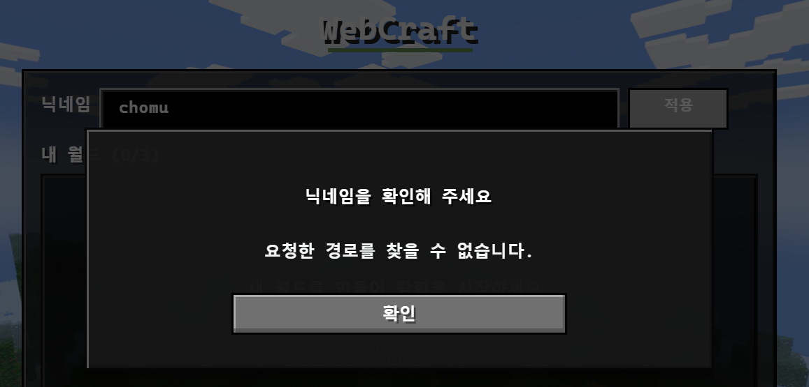

</details>

### Lv3. 요청 검증과 DTO: 플레이어 등록
- [x] API 명세에 맞게 플레이어 등록 Controller, 요청 DTO와 서비스를 구현합니다. 닉네임은 비어 있지 않은 2~12글자이며, 영문 대소문자와 숫자, 밑줄만 허용합니다.
- [x] 이미 등록된 닉네임이면 `ConflictException`으로 `DUPLICATE_NICKNAME` 에러를 던집니다.
- [x] Controller의 요청 매핑, JSON 본문 바인딩, DTO 검증과 성공 응답을 명세대로 구현합니다.
- [x] 중복이 아니면 제공된 `savePlayer(new Player(request.getNickname()))`로 저장합니다. 성공 응답은 본문 없는 `201`입니다.

<details>
<summary><b>[자세히] </b></summary>

1. 요청 DTO와 검증 규칙 (`CreatePlayerRequest`)
* 닉네임 제약을 Bean Validation 애노테이션으로 선언 — 검증 책임을 DTO에 두어 Controller와 Service는 검증을 신경 쓰지 않음

```java
@NotBlank
@Size(min = 2, max = 12)
@Pattern(regexp = "^[a-zA-Z0-9_]+$")
private final String nickname;
```

| 애노테이션 | 거르는 값 |
|---|---|
| `@NotBlank` | `null`, `""`, 공백만 있는 값 |
| `@Size(min = 2, max = 12)` | `"A"`, 13글자 이상 |
| `@Pattern` | `한글`, `ab cd`, `ab-cd`, `ab!` |

`@Size`와 `@Pattern`은 값이 `null`이면 검사를 건너뛰므로, `null`을 거르려면 `@NotBlank`가 반드시 필요합니다.

 [CreatePlayerRequest.java 바로가기](./src/main/java/com/gameexpert/player/dto/CreatePlayerRequest.java)

---

2. Controller (`PlayerController`)
* `@RequestBody`로 JSON 본문을 DTO에 바인딩
* `@Valid`로 DTO 검증을 수행 — 실패 시 서비스를 호출하지 않고 `400` 반환
* 성공 시 본문 없이 `201 Created` 반환

```java
@PostMapping("/players")
public ResponseEntity<Void> create(@Valid @RequestBody CreatePlayerRequest request) {
    playerService.createPlayer(request);
    return ResponseEntity.status(HttpStatus.CREATED).build();
}
```

`ResponseEntity.build()`는 본문 없이 상태 코드만 응답합니다.

 [PlayerController.java 바로가기](./src/main/java/com/gameexpert/player/controller/PlayerController.java)

---

3. Service (`PlayerService`)
* 저장 전 `existsByNickname`으로 중복을 확인하고, 중복이면 저장을 시도하지 않고 `ConflictException` 발생
* 동시 등록으로 제약 위반이 발생하는 경우는 제공된 `savePlayer`가 처리

```java
@Transactional
public void createPlayer(CreatePlayerRequest request) {
    if (playerRepository.existsByNickname(request.getNickname())) {
        throw new ConflictException("DUPLICATE_NICKNAME");
    }
    savePlayer(new Player(request.getNickname()));
}
```

두 검사는 서로 다른 상황을 담당합니다.

| 위치 | 담당하는 상황 |
|---|---|
| `existsByNickname` 사전 검사 | 이미 등록된 닉네임으로 들어온 일반적인 요청 |
| `savePlayer`의 `catch` | 두 요청이 동시에 사전 검사를 통과한 뒤 발생하는 제약 위반 |

사전 검사와 저장 사이에는 틈이 있어, 동시 요청은 양쪽 모두 "중복 없음"으로 판정될 수 있습니다. 이때 뒤늦은 INSERT가 유니크 제약에 걸리며, 이를 `catch`가 `409`로 변환합니다.

 [PlayerService.java 바로가기](./src/main/java/com/gameexpert/player/service/PlayerService.java)

</details>

- [x] 테스트 확인: `PlayerRegistrationTest.java`와 `PlayerApiTest.java`의 주석을 해제한 뒤 실행합니다.

<details>
<summary><b>[자세히]</b></summary>

```Bash
.\gradlew test
```

실행 결과는 Gradle이 생성하는 HTML 리포트에서 테스트별로 확인할 수 있습니다.

```Bash
build/reports/tests/test/index.html
```

</details>

- [x] 확인: 게임 화면에서 닉네임을 적용할 수 있습니다. 잘못된 닉네임이나 이미 등록된 닉네임은 새로 저장되지 않습니다.

<details>
<summary><b>[자세히]</b></summary>

`http://localhost:8080/`에서 닉네임을 입력하고 적용하면 등록이 완료되어 버튼이 `수정`으로 바뀌고 월드 목록이 표시됩니다.

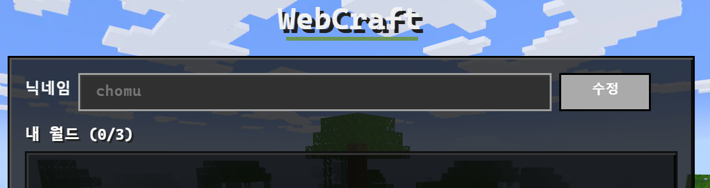

</details>

### Lv4. 월드 생성
- [x] `worldOperations.duringCreation()`에 람다를 전달하고 그 결과를 반환합니다.
- [x] 람다 안에서 `worldRepository.countRootWorlds()`가 `MAX_WORLDS` 이상이면 `ConflictException("WORLD_LIMIT_REACHED")`을 던지고, 제한을 넘지 않으면 `createPreparedWorld(request)`의 결과를 반환합니다.

<details>
<summary><b>[자세히] </b></summary>

1. 생성 잠금 안에서 개수 확인과 저장을 함께 수행
* `duringCreation()`이 잡아주는 생성 잠금 안에서 개수 확인과 월드 생성이 모두 이루어지도록 람다 내부에 배치
* 잠금 밖에서 개수를 세면 동시 요청 시 두 요청이 모두 제한을 통과해 월드가 4개가 될 수 있음

```java
@Transactional
public CommittedWorldCreation createWorld(CreateWorldRequest request) {
    if (!baselineReadiness.isReady()) {
        throw new ServiceUnavailableException("WORLD_BASELINE_INITIALIZING");
    }

    return worldOperations.duringCreation(() -> {
        if (worldRepository.countRootWorlds() >= MAX_WORLDS) {
            throw new ConflictException("WORLD_LIMIT_REACHED");
        }

        return createPreparedWorld(request);
    });
}
```

 [WorldService.java 바로가기](./src/main/java/com/gameexpert/world/service/WorldService.java)

---

2. 개수 제한 경계
`MAX_WORLDS`는 3이며, 비교 연산자는 `>=`를 사용합니다. `>`를 쓰면 월드가 3개일 때 4번째 생성이 허용됩니다.

| 기존 월드 수 | 판정 |
|---|---|
| 0 | 생성 |
| 2 | 생성 (3번째) |
| 3 | `WORLD_LIMIT_REACHED` |
| 4 | `WORLD_LIMIT_REACHED` |

</details>

- [x] 테스트 확인: `WorldCreationTest.java`의 주석을 해제한 뒤 실행합니다.

<details>
<summary><b>[자세히]</b></summary>

```Bash
.\gradlew test
```

실행 결과는 Gradle이 생성하는 HTML 리포트에서 테스트별로 확인할 수 있습니다.

```Bash
build/reports/tests/test/index.html
```

</details>

- [x] 확인: 새 월드가 목록에 표시되고 서버를 재시작해도 남아 있습니다.

<details>
<summary><b>[자세히]</b></summary>

월드를 생성하면 목록에 이름·난이도·접속자 수·시드가 표시되고, 상단 카운터가 `내 월드 (1/3)`으로 갱신됩니다.

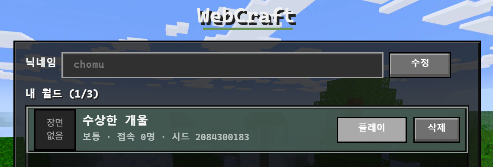

월드 정보는 MySQL 컨테이너의 볼륨에 저장되므로 애플리케이션을 재시작해도 유지됩니다.

```Bash
docker compose restart app
```

</details>

### Lv5. 채팅 저장과 내역 조회
- [x] `saveMessage()`에서 `worldId`로 월드를 조회하고, 없으면 `NotFoundException`으로 `WORLD_NOT_FOUND` 에러를 던집니다.
- [x] 조회한 월드와 전달받은 닉네임, 내용으로 `ChatMessage`를 만들어 `chatMessageRepository.save()`로 저장하고, 제공된 `savedResponse(worldId, saved)`의 결과를 반환합니다.
- [x] 최근 채팅을 대화 순서대로 반환합니다.

<details>
<summary><b>[자세히] </b></summary>

1. 채팅 저장 (`saveMessage`)
* 월드 조회 실패를 `Optional.orElseThrow`로 처리하여 존재하지 않는 월드에는 저장하지 않음
* 저장된 엔티티를 `savedResponse`에 전달 — `@CreationTimestamp`가 채운 `createdAt`이 응답에 포함됨

```java
@Transactional
public ChatMessageResponse saveMessage(Long worldId, String sender, String content) {
    World world = worldRepository.findById(worldId)
            .orElseThrow(() -> new NotFoundException("WORLD_NOT_FOUND"));
    ChatMessage chat = chatMessageRepository.save(new ChatMessage(world, sender, content));
    return savedResponse(worldId, chat);
}
```

---

2. 최근 채팅 조회 (`getRecentMessages`)
* **최신 N건을 고른 뒤 대화 순서로 뒤집는** 방식 — 오래된 것부터 읽으면 최신 N건을 알 수 없으므로 정렬은 내림차순으로 조회
* `limit`은 1 이상 `MAX_LIMIT`(100) 이하로 보정

```java
int capped = Math.min(Math.max(limit, 1), MAX_LIMIT);

List<ChatMessage> recent = chatMessageRepository
        .findByWorldIdOrderByCreatedAtDescIdDesc(worldId, PageRequest.of(0, capped));

Collections.reverse(recent);
```

정렬 조건에 `id DESC`를 함께 둔 이유는 **같은 시각에 저장된 메시지의 순서를 고정**하기 위해서입니다. 뒤집은 뒤 id 오름차순, 즉 저장된 순서가 됩니다.

| 단계 | 결과 |
|---|---|
| `createdAt DESC, id DESC`로 조회 | 최신 → 과거, 동시각은 나중 저장분이 앞 |
| `Collections.reverse` | 과거 → 최신, 동시각은 먼저 저장분이 앞 |

`createdAt`만으로 정렬하면 같은 시각 메시지의 순서가 보장되지 않습니다.

 [ChatService.java 바로가기](./src/main/java/com/gameexpert/chat/service/ChatService.java)

</details>

- [x] 테스트 확인: `ChatServiceTest.java`의 주석을 해제한 뒤 실행합니다.

<details>
<summary><b>[자세히]</b></summary>

```Bash
.\gradlew test
```

실행 결과는 Gradle이 생성하는 HTML 리포트에서 테스트별로 확인할 수 있습니다.

```Bash
build/reports/tests/test/index.html
```

</details>

- [x] 확인: 저장된 내용과 반환된 목록의 건수 및 순서를 확인합니다. 이 검사는 게임 서버나 REST API 실행 없이 수행합니다.

<details>
<summary><b>[자세히]</b></summary>

`ChatServiceTest`가 H2 인메모리 데이터베이스를 직접 구성하므로, 컨테이너나 REST API를 실행하지 않고 확인할 수 있습니다.

`selectsLatestThenReturnsAscendingAndIsolatesWorlds`의 `assertThat(messages)` 줄에 중단점을 걸고 반환 목록을 확인했습니다.

```Bash
messages = {ImmutableCollections$ListN@11242}  size = 3
 0 = {ChatMessageResponse@15611}
  sender = "Alice"
  content = "tie-first"
  createdAt = {LocalDateTime@15616} "2026-01-01T12:00"
 1 = {ChatMessageResponse@15612}
  sender = "Alice"
  content = "tie-last"
  createdAt = {LocalDateTime@15619} "2026-01-01T12:00"
 2 = {ChatMessageResponse@15613}
  sender = "Alice"
  content = "newer"
  createdAt = {LocalDateTime@15622} "2026-01-01T12:00:01"
```

**건수** — `limit`이 3이므로 `size = 3`. 더 오래된 메시지와 다른 월드의 메시지는 제외됩니다.

**순서** — `12:00`으로 시각이 같은 `tie-first`와 `tie-last`가 저장된 순서대로 앞에 오고, 가장 최신인 `12:00:01`의 `newer`가 마지막에 위치합니다. 과거 → 최신의 대화 순서입니다.

**저장 내용** — 각 항목의 `sender`, `content`, `createdAt`이 저장 시점의 값 그대로 담겨 있습니다.

</details>

### Lv6. 최근 채팅 조회 API 구현
- [x] 요청 경로, HTTP 메서드, 경로 변수와 선택 파라미터의 기본값을 명세에 맞게 구현합니다.
- [x] `chats()`에 명세의 HTTP 메서드와 요청 경로를 매핑하고, URL의 월드 ID와 `limit`을 매개변수로 받습니다.
- [x] `chatService.getRecentMessages(worldId, limit)`의 결과를 명세의 성공 상태 코드와 함께 반환합니다.

<details>
<summary><b>[자세히] </b></summary>

1. 요청 매핑
* 명세의 `GET /worlds/{worldId}/chats`를 `@GetMapping`으로 매핑
* `worldId`는 URL 경로에 포함되므로 `@PathVariable`, `limit`은 쿼리 파라미터이므로 `@RequestParam`으로 수신
* `limit`을 생략한 요청을 위해 `defaultValue = "50"` 지정

```java
@GetMapping("/worlds/{worldId}/chats")
public ResponseEntity<List<ChatMessageResponse>> chats(
        @PathVariable("worldId") Long worldId,
        @RequestParam(value = "limit", defaultValue = "50") int limit) {

    return ResponseEntity.ok(chatService.getRecentMessages(worldId, limit));
}
```

| 값 | 위치 | 애노테이션 |
|---|---|---|
| `worldId` | `/worlds/**42**/chats` — 경로 | `@PathVariable` |
| `limit` | `/worlds/42/chats?**limit=2**` — 쿼리 | `@RequestParam` |

---

2. 응답
* 성공 시 `200 OK`와 함께 조회 결과를 JSON 배열로 반환 (`ResponseEntity.ok`)
* `limit` 값의 범위 보정은 서비스 계층이 담당하므로 컨트롤러는 전달받은 값을 그대로 넘김

 [WorldChatController.java 바로가기](./src/main/java/com/gameexpert/chat/controller/WorldChatController.java)

</details>

- [x] 테스트 확인: `RecentChatApiTest.java`의 주석을 해제한 뒤 실행합니다.

<details>
<summary><b>[자세히]</b></summary>

```Bash
.\gradlew test
```

실행 결과는 Gradle이 생성하는 HTML 리포트에서 테스트별로 확인할 수 있습니다.

```Bash
build/reports/tests/test/index.html
```

</details>

- [x] 확인: API를 호출하여 성공 상태 코드와 응답을 확인합니다.

<details>
<summary><b>[자세히]</b></summary>

컨테이너를 실행한 뒤 API를 호출합니다.

```Bash
GET http://localhost:8080/worlds/1/chats?limit=50
```

`200 OK`와 함께 조회 결과가 JSON 배열로 반환됩니다.

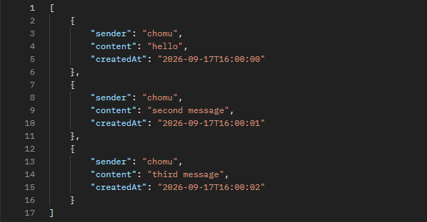

응답 필드는 `sender`, `content`, `createdAt`이며, `createdAt`이 오름차순으로 정렬되어 과거 → 최신의 대화 순서로 반환됩니다.

> 채팅 전송은 WebSocket을 통해 이루어지며 이후 레벨에서 구현하므로, 조회 API의 응답 형식과 순서를 확인하기 위해 `chat_messages`에 데이터를 직접 넣고 호출했습니다. 저장된 채팅이 없으면 빈 배열 `[]`이 반환됩니다.

</details>

### Lv7. WebSocket 연결과 사용자 식별
- [x] `playerRepository.findByNickname(nickname)`으로 플레이어를 조회해 `player`에 대입합니다. 조회 결과가 없으면 `null`을 사용합니다.
- [x] `worldRepository.findById(worldId)`로 월드를 조회해 `world`에 대입합니다. 조회 결과가 없으면 `null`을 사용합니다.
- [x] `attributes`에 `ATTR_NICKNAME`을 키로 `nickname`을, `ATTR_WORLD_ID`를 키로 `worldId`를 저장합니다.

<details>
<summary><b>[자세히] </b></summary>

1. 플레이어와 월드 조회
* 조회 실패를 예외가 아닌 `null`로 처리 — 핸드셰이크 자체는 성립시키고 연결 직후 에러 코드로 닫는 구조이므로, 여기서 예외를 던지면 클라이언트가 실패 사유를 받지 못함

```java
Player player = playerRepository.findByNickname(nickname).orElse(null);
if (player == null) {
    attributes.put(ATTR_ERROR_CODE, 4000);
    return true;
}

Long worldId = readWorldId(request);
...
World world = worldRepository.findById(worldId).orElse(null);
if (world == null || worldRepository.isDimensionChild(worldId)) {
    attributes.put(ATTR_ERROR_CODE, 4001);
    return true;
}
```

| 상황 | 에러 코드 |
|---|---|
| 닉네임이 없거나 등록되지 않은 플레이어 | `4000` |
| 월드 ID를 읽을 수 없거나 존재하지 않는 월드 | `4001` |

---

2. 연결 속성 저장
* 이후 메시지 처리 단계에서 `WebSocketSession.getAttributes()`로 꺼내 쓸 값들을 저장

```java
attributes.put(ATTR_NICKNAME, nickname);
attributes.put(ATTR_WORLD_ID, worldId);
attributes.put(ATTR_PLAYER_ID, player.getId());
attributes.put(ATTR_WORLD_SEED, (int) world.getSeed());
attributes.put(ATTR_WORLD_DIFFICULTY, world.getDifficulty());
```

 [NicknameHandshakeInterceptor.java 바로가기](./src/main/java/com/gameexpert/ws/NicknameHandshakeInterceptor.java)

</details>

- [x] 테스트 확인: `NicknameHandshakeInterceptorTest.java`의 주석을 해제한 뒤 실행합니다.

<details>
<summary><b>[자세히]</b></summary>

```Bash
.\gradlew test
```

실행 결과는 Gradle이 생성하는 HTML 리포트에서 테스트별로 확인할 수 있습니다.

```Bash
build/reports/tests/test/index.html
```

</details>

- [x] 확인: 제공 테스트에서 정상 요청의 닉네임과 월드 ID가 세션 속성에 저장되는지 확인합니다.

<details>
<summary><b>[자세히]</b></summary>

`looksUpRequestedPlayerAndWorldAndStoresConnectionAttributes`가 `/ws/worlds/72?nickname=Alex` 형태의 요청으로 `beforeHandshake()`를 호출하고, 세션 속성에 닉네임과 월드 ID가 저장됐는지 검증합니다.

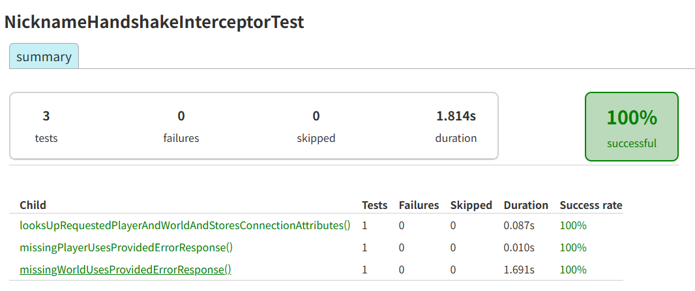

</details>

### Lv8. HandshakeInterceptor 등록
- [x] `WebSocketConfig`에서 `/ws/worlds/{worldId}` 경로의 핸들러에 주입된 `NicknameHandshakeInterceptor`를 등록합니다.

<details>
<summary><b>[자세히] </b></summary>

1. 핸들러에 인터셉터 연결
* `NicknameHandshakeInterceptor`가 `@Component`로 빈 등록되어 있어도 연결 요청에 자동으로 적용되지는 않음
* 핸들러 등록 시 `addInterceptors()`로 명시적으로 연결해야 `beforeHandshake()`가 호출됨

```java
@Override
public void registerWebSocketHandlers(WebSocketHandlerRegistry registry) {
    registry.addHandler(gameWebSocketHandler, "/ws/worlds/{worldId}")
            .addInterceptors(nicknameInterceptor)
            .setAllowedOriginPatterns(properties.wsAllowedOrigins().toArray(String[]::new));
}
```

 [WebSocketConfig.java 바로가기](./src/main/java/com/gameexpert/config/WebSocketConfig.java)

</details>

- [x] 테스트 확인: `WebSocketConfigTest.java`의 주석을 해제한 뒤 실행합니다.

<details>
<summary><b>[자세히]</b></summary>

```Bash
.\gradlew test
```

실행 결과는 Gradle이 생성하는 HTML 리포트에서 테스트별로 확인할 수 있습니다.

```Bash
build/reports/tests/test/index.html
```

</details>

- [x] 확인: Postman으로 연결을 요청하고 로그 또는 디버거로 `beforeHandshake()` 실행과 월드 ID 및 닉네임의 세션 속성 저장을 확인합니다.

<details>
<summary><b>[자세히]</b></summary>

Postman의 WebSocket 요청으로 등록된 닉네임과 생성된 월드 ID를 사용해 연결합니다.

```Bash
ws://localhost:8080/ws/worlds/1?nickname=chomu
```

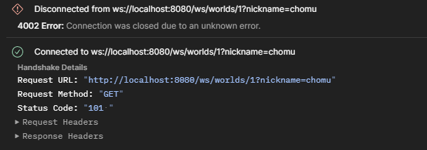

`101 Switching Protocols`로 핸드셰이크가 성사되었고, 연결은 코드 `4002`로 종료됩니다.

`GameWebSocketHandler`는 연결 직후 세션 속성이 비어 있으면 `연결 정보 누락: HandshakeInterceptor 구현과 등록을 확인하세요.` 를 로그로 남기고 `4000`으로 닫습니다. 서버 로그에 해당 메시지가 없고 `4002`로 닫혔다는 것은, **`beforeHandshake()`가 실행되어 닉네임과 월드 ID가 세션 속성에 저장된 뒤** 다음 단계인 세션 등록에서 종료되었음을 의미합니다.

```Bash
docker compose logs app --tail 40
```

`4002`는 `WorldSessionRegistry.register()`가 아직 구현되지 않아 발생하며, 다음 레벨에서 구현합니다.

</details>

### Lv9. 월드별 WebSocket 세션 관리
- [x] `register()`에서 `sessions.putIfAbsent(nicknameKey, candidate)`로 연결을 등록하고, 반환값이 `null`이면 새로 등록한 것이므로 `added`를 `true`로 설정합니다. 이미 등록된 연결이 있으면 덮어쓰지 않습니다.
- [x] `get()`에서 `sessions.get(key(nickname))`으로 연결을 조회해 반환합니다.

<details>
<summary><b>[자세히] </b></summary>

1. 연결 등록 (`register`)
* `putIfAbsent`는 키가 없을 때만 값을 넣고 `null`을, 이미 있으면 기존 값을 반환하며 **덮어쓰지 않음**
* 반환값이 `null`인 경우에만 새로 등록된 것으로 판단

```java
Entry existing = sessions.putIfAbsent(nicknameKey, candidate);
boolean added = (existing == null);

if (added) {
    registered.set(candidate);
}
```

중복이면 `registered`가 비어 있으므로 `register()`는 `null`을 반환하고, 호출한 `GameWebSocketHandler`가 해당 연결을 `4002`로 닫습니다.

---

2. 연결 조회 (`get`)
* `key()`가 닉네임을 소문자로 변환하므로 대소문자 구분 없이 같은 연결을 찾음
* 해당 월드에 연결 목록이 없으면 `null` 반환

```java
public Entry get(Long worldId, String nickname) {
    ConcurrentHashMap<String, Entry> sessions = worlds.get(worldId);
    if (sessions == null) {
        return null;
    }

    return sessions.get(key(nickname));
}
```

 [WorldSessionRegistry.java 바로가기](./src/main/java/com/gameexpert/ws/WorldSessionRegistry.java)

</details>

- [x] 테스트 확인: `WorldSessionRegistryTest.java`의 주석을 해제한 뒤 실행합니다.

<details>
<summary><b>[자세히]</b></summary>

```Bash
.\gradlew test
```

실행 결과는 Gradle이 생성하는 HTML 리포트에서 테스트별로 확인할 수 있습니다.

```Bash
build/reports/tests/test/index.html
```

</details>

- [x] 확인: 등록한 연결을 월드와 닉네임으로 조회할 수 있고, 같은 월드의 중복 닉네임은 기존 연결을 덮어쓰지 않습니다.

<details>
<summary><b>[자세히]</b></summary>

Postman의 WebSocket 요청으로 연결하면 Lv 8에서 `4002`로 닫히던 연결이 유지되며, 서버가 월드 상태·플레이어 목록 등 초기 메시지를 전송합니다.

```Bash
ws://localhost:8080/ws/worlds/1?nickname=chomu
```

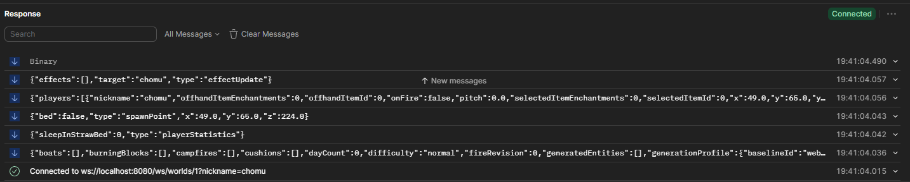

수신한 플레이어 목록에 `"nickname":"chomu"`가 포함되어, 핸드셰이크에서 저장한 닉네임이 세션 등록까지 이어졌음을 확인할 수 있습니다.

---

위 연결을 유지한 상태로 같은 월드·같은 닉네임으로 다시 연결하면 **새 연결만 즉시 종료**되고 기존 연결은 그대로 유지됩니다.

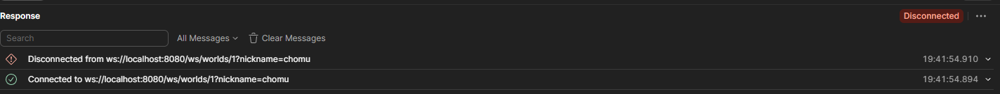

`putIfAbsent`가 기존 항목을 덮어쓰지 않아 `register()`가 `null`을 반환하고, 나중에 들어온 연결이 닫히는 동작입니다.

</details>

### Lv10. Redis 접속 상태 관리
- [x] `join()`에서 `redisTemplate.opsForZSet().add(key, connectionId, expiresAt())`로 접속 정보를 저장합니다.
- [x] `leave()`에서 `redisTemplate.opsForZSet().remove(key(worldId), connectionId)`로 종료된 연결을 삭제합니다.
- [x] 연결별 만료는 90초, 키 전체 정리용 TTL은 180초입니다.

<details>
<summary><b>[자세히] </b></summary>

1. 접속 등록 (`join`)
* Sorted Set의 member에 `connectionId`, score에 만료 시각(에포크 밀리초)을 저장
* 월드별로 `world:{worldId}:presence` 키를 사용해 접속 목록을 분리

```java
public void join(Long worldId, String connectionId) {
    String key = key(worldId);
    redisTemplate.opsForZSet().add(key, connectionId, expiresAt());
    redisTemplate.expire(key, KEY_TTL);
}
```

score를 만료 시각으로 두면 `onlineCount()`에서 `removeRangeByScore`로 만료된 연결을 한 번에 정리할 수 있습니다.

---

2. 접속 해제 (`leave`)
* 종료된 연결만 해당 월드의 Set에서 제거

```java
public void leave(Long worldId, String connectionId) {
    redisTemplate.opsForZSet().remove(key(worldId), connectionId);
}
```

키를 `key(worldId)`로 특정하므로, 같은 `connectionId`가 다른 월드에 있어도 영향을 받지 않습니다.

---

3. 만료 시간
* 연결별 만료 90초 — score에 반영되어 만료된 연결이 접속자 수에서 제외됨
* 키 전체 TTL 180초 — 모든 연결이 끊긴 월드의 키가 Redis에 남지 않도록 정리

```java
private static final Duration TTL = Duration.ofSeconds(90);
private static final Duration KEY_TTL = Duration.ofSeconds(180);
```

 [PresenceService.java 바로가기](./src/main/java/com/gameexpert/presence/PresenceService.java)

</details>

- [x] 테스트 확인: Docker를 실행하고 `PresenceServiceTest.java`의 주석을 해제한 뒤 실행합니다.

<details>
<summary><b>[자세히]</b></summary>

`PresenceServiceTest`는 Testcontainers로 Redis 컨테이너를 직접 띄워 검증하므로 Docker가 실행 중이어야 합니다.

```Bash
.\gradlew test
```

실행 결과는 Gradle이 생성하는 HTML 리포트에서 테스트별로 확인할 수 있습니다.

```Bash
build/reports/tests/test/index.html
```

</details>

- [x] 확인: 연결하면 Redis에 연결 ID와 만료 시각이 저장되고, 정상 종료하면 해당 원소가 제거됩니다.

<details>
<summary><b>[자세히]</b></summary>

Postman의 WebSocket 요청으로 연결한 뒤 Redis에서 Sorted Set을 조회합니다.

```Bash
docker exec -it expert-assignment-redis redis-cli -a <REDIS_PASSWORD> --no-auth-warning ZRANGE world:1:presence 0 -1 WITHSCORES
```

**연결 중** — member에 연결 ID, score에 만료 시각이 저장됩니다.

```Bash
1) "93261e3e-20c5-4e6a-a242-d28880553d72:dimension:0"
2) "1789730268569"
```

score `1789730268569`는 연결 시각에 90초를 더한 값입니다.

**연결 종료 후** — `leave()`가 해당 원소를 제거합니다.

```Bash
(empty array)
```

만료 시간(90초)보다 짧은 간격에 확인하여, 만료 정리가 아닌 `leave()` 호출로 제거된 것임을 확인했습니다.

</details>

### Lv11. 메시지 라우팅과 Ping/Pong
- [x] `MessageRouter.route()`에서 찾아 둔 `handler`의 `handle(context, message)`를 호출합니다.
- [x] `PingWsHandler`에서 `presenceService.heartbeat(...)`로 현재 연결의 Redis 접속 상태를 갱신합니다.
- [x] `broadcaster.sendTo(context.session(), new PongResponse())`로 ping을 보낸 연결에 pong을 응답합니다.

<details>
<summary><b>[자세히] </b></summary>

1. 메시지 라우팅 (`MessageRouter`)
* `type` 값으로 찾은 핸들러에 `context`와 파싱된 메시지를 그대로 전달
* 핸들러 실행 중 발생하는 예외는 종류별로 에러 코드로 변환해 응답

```java
try {
    handler.handle(context, message);
} catch (ActionQueueOverflowException exception) {
    error(context, "QUEUE_FULL");
} catch (IllegalArgumentException exception) {
    error(context, "INVALID_MESSAGE");
} catch (Exception exception) {
    error(context, "INTERNAL_ERROR");
}
```

 [MessageRouter.java 바로가기](./src/main/java/com/gameexpert/ws/MessageRouter.java)

---

2. Ping 처리 (`PingWsHandler`)
* 현재 세션이 레지스트리에 등록된 연결과 같은지 확인한 뒤에만 처리
* Redis 접속 상태를 갱신하고, ping을 보낸 연결에만 pong을 응답

```java
WorldSessionRegistry.Entry connection = registry.get(context.worldId(), context.nickname());
if (connection == null || connection.session() != context.session()) {
    return;
}

presenceService.heartbeat(context.worldId(), connection.connectionId());
broadcaster.sendTo(context.session(), new PongResponse());
```

`heartbeat()`는 `ZADD XX`로 **기존 원소의 점수만 갱신**하므로, 이미 종료된 연결이 되살아나지 않습니다.

 [PingWsHandler.java 바로가기](./src/main/java/com/gameexpert/ws/handler/PingWsHandler.java)

</details>

- [x] 테스트 확인: `MessageRouterTest.java`와 `PingWsHandlerTest.java`의 주석을 해제한 뒤 실행합니다.

<details>
<summary><b>[자세히]</b></summary>

```Bash
.\gradlew test
```

실행 결과는 Gradle이 생성하는 HTML 리포트에서 테스트별로 확인할 수 있습니다.

```Bash
build/reports/tests/test/index.html
```

</details>

- [x] 확인: 게임에 입장한 상태에서 `GET /worlds`의 접속 인원이 90초 후에도 유지되는지 확인합니다.

<details>
<summary><b>[자세히]</b></summary>

게임에 입장한 상태에서 시간 간격을 두고 월드 목록을 조회하면 접속 인원이 유지됩니다.

```Bash
curl.exe -s "http://localhost:8080/worlds"
```

```Bash
[{"id":1,"name":"수상한 개울","seed":2084300183,"onlineCount":1,"difficulty":"normal"}]
```

---

유지되는 이유는 ping마다 Redis의 만료 시각이 갱신되기 때문입니다. 같은 연결의 score를 시간차를 두고 조회하면 값이 증가합니다.

```Bash
docker exec -it expert-assignment-redis redis-cli -a <REDIS_PASSWORD> --no-auth-warning ZRANGE world:1:presence 0 -1 WITHSCORES
```

```Bash
1) "47941a20-0ef6-440f-a0ae-68b59b11e4b1:dimension:0"
2) "1789732957857"
```

```Bash
1) "47941a20-0ef6-440f-a0ae-68b59b11e4b1:dimension:0"
2) "1789732988197"
```

연결 ID는 같고 score만 약 30초 증가했습니다. 클라이언트가 15초마다 보내는 ping을 `PingWsHandler`가 처리해 `heartbeat()`를 호출한 결과이며, Lv 10 시점에는 갱신 주체가 없어 90초 뒤 접속 인원이 0으로 떨어졌습니다.

</details>

### Lv12. 플레이어 이동 요청 처리
- [x] 명세의 필드를 읽어 위치, 시선 방향과 이동 상태를 구합니다.
- [x] 읽은 값으로 `PlayerAction.Move`를 생성하고 `engineManager.enqueue(월드 ID, 이동 요청)`에 전달합니다.
- [x] 생성자 인자 순서는 `nickname`, `x`, `y`, `z`, `yaw`, `pitch`, `crouching`, `gliding`, `finalSceneActionId` 입니다.

<details>
<summary><b>[자세히] </b></summary>

1. 이동 요청 생성과 전달
* 좌표·시선·이동 상태는 메시지에서 읽고, **월드 ID와 닉네임은 메시지가 아닌 연결 정보(`context`)에서 사용**

```java
@Override
public void handle(WsMessageContext context, JsonNode message) {
    String finalSceneActionId = WsFields.optionalFinalSceneActionId(message);
    PlayerAction.Move move = new PlayerAction.Move(
            context.nickname(),
            WsFields.finiteNumber(message, "x"),
            WsFields.finiteNumber(message, "y"),
            WsFields.finiteNumber(message, "z"),
            finiteFloat(message, "yaw"),
            finiteFloat(message, "pitch"),
            WsFields.booleanValue(message, "crouching"),
            WsFields.booleanValue(message, "gliding"),
            finalSceneActionId
    );

    engineManager.enqueue(context.worldId(), move);
}
```

메시지에 `worldId`나 `nickname`이 포함되어 있어도 사용하지 않습니다. 이 값들은 핸드셰이크 단계에서 확정되어 세션 속성에 저장된 값을 써야, 다른 사용자의 이름으로 이동 요청을 보내는 것을 막을 수 있습니다.

---

2. 필드 타입별 읽기

| 인자 | 자료형 | 읽는 방법 |
|---|---|---|
| `x`, `y`, `z` | `double` | `WsFields.finiteNumber(message, 필드명)` |
| `yaw`, `pitch` | `float` | `WsFields.finiteFloat(message, 필드명)` |
| `crouching`, `gliding` | `boolean` | `WsFields.booleanValue(message, 필드명)` |

 [MoveWsHandler.java 바로가기](./src/main/java/com/gameexpert/ws/handler/MoveWsHandler.java)

</details>

- [x] 테스트 확인: `MoveWsHandlerTest.java`의 주석을 해제한 뒤 실행합니다.

<details>
<summary><b>[자세히]</b></summary>

```Bash
.\gradlew test
```

실행 결과는 Gradle이 생성하는 HTML 리포트에서 테스트별로 확인할 수 있습니다.

```Bash
build/reports/tests/test/index.html
```

</details>

- [x] 확인: 게임에서 이동 키를 눌러 자신의 캐릭터가 이동하는지 확인합니다.

<details>
<summary><b>[자세히]</b></summary>

월드에 입장한 뒤 이동 키를 누르면 캐릭터의 위치가 이동합니다.

**이동 전**

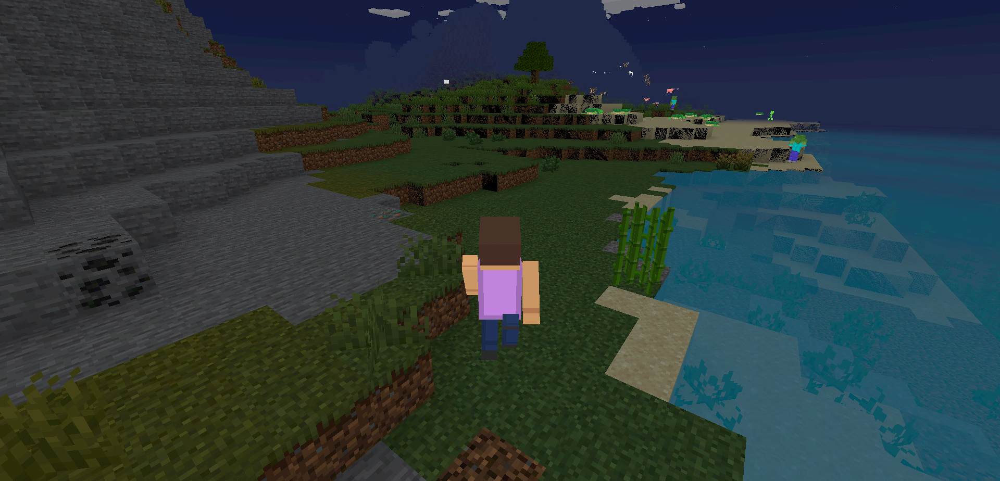

**이동 후**

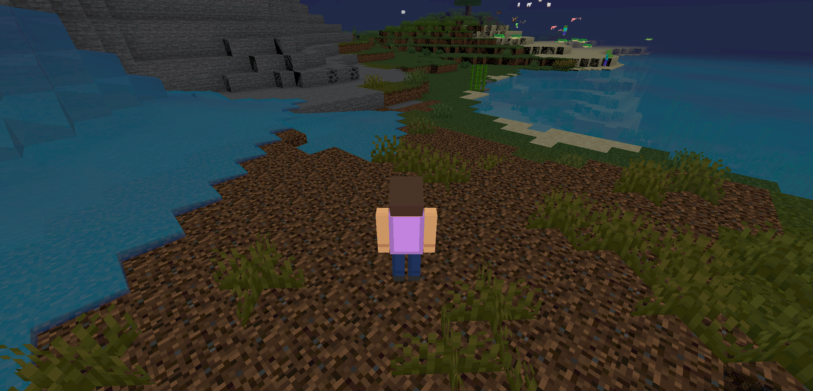

배경의 지형이 달라진 것으로 캐릭터가 실제로 이동했음을 확인할 수 있습니다.

</details>

### Lv13. 채팅 요청 처리와 응답 구성
- [x] `readContent()`에서 명세의 채팅 내용 필드를 읽어 반환합니다.
- [x] 명세를 보고 `ChatResponse`의 필드와 생성자를 완성합니다. `type`은 매개변수로 받지 않고 항상 `"chat"`으로 채웁니다.
- [x] `createResponse()`에서 `chatService.saveMessage()`로 채팅을 저장하고, 저장 결과로 `ChatResponse`를 만들어 반환합니다.

<details>
<summary><b>[자세히] </b></summary>

1. 요청 필드 읽기
* `WsFields.text()`는 필드가 없거나 문자열이 아니면 `IllegalArgumentException`을 던지고, 이를 `MessageRouter`가 `INVALID_MESSAGE` 응답으로 변환 — 핸들러에 검증 코드나 `try/catch`를 두지 않아도 잘못된 요청이 걸러짐

```java
private String readContent(JsonNode message) {
    return WsFields.text(message, "content");
}
```

---

2. `type` 필드 고정
* 생성자 매개변수가 아니라 선언과 동시에 초기화 — 호출부가 다른 값을 넣을 여지를 없애고, 모든 채팅 응답이 같은 `type`을 갖도록 보장

```java
private final String type = "chat";
private final String sender;
private final String content;
private final LocalDateTime timestamp;
```

 [ChatResponse.java 바로가기](./src/main/java/com/gameexpert/ws/dto/ChatResponse.java)

---

3. 저장 결과로 응답 구성
* 응답을 **요청에서 읽은 값이 아니라 `saveMessage()`가 돌려준 값**으로 조립 — `timestamp`는 저장 시점에만 확정되고, 저장 과정에서 내용이 가공될 수 있으므로 클라이언트가 받는 응답과 DB에 남은 기록이 어긋나지 않아야 함
* 월드와 보낸 사람은 메시지가 아닌 연결 정보(`context`)에서 사용 — 다른 사용자의 이름으로 채팅을 보내는 것을 막기 위함

```java
private ChatResponse createResponse(WsMessageContext context, String content) {
    ChatMessageResponse saved = chatService.saveMessage(context.worldId(), context.nickname(), content);
    return new ChatResponse(saved.getSender(), saved.getContent(), saved.getCreatedAt());
}
```

 [ChatWsHandler.java 바로가기](./src/main/java/com/gameexpert/ws/handler/ChatWsHandler.java)

</details>

- [x] 테스트 확인: `ChatWsHandlerTest.java`의 주석을 해제한 뒤 실행합니다.

<details>
<summary><b>[자세히]</b></summary>

```Bash
.\gradlew test
```

`savesUsingConnectionIdentityAndBuildsResponseFromSavedResult`는 `saveMessage()`가 요청과 **다른 값**(`"SavedAlice"`, `"저장된 내용"`)을 반환하도록 스텁해 둡니다. 요청에서 읽은 값으로 응답을 만들면 이 단언에서 걸리므로, 응답이 저장 결과에서 조립됐는지를 가려냅니다. 메시지에 포함된 `nickname`, `worldId`를 쓰지 않았는지도 함께 검증합니다.

```Bash
build/reports/tests/test/index.html
```

</details>

- [x] 확인: 게임에서 일반 채팅을 보내고 최근 채팅 조회 API와 DB에서 저장 결과를 확인합니다.

<details>
<summary><b>[자세히]</b></summary>

월드에 입장해 채팅을 입력한 뒤, Lv6에서 구현한 최근 채팅 조회 API로 저장 결과를 확인했습니다.

```Bash
GET http://localhost:8080/worlds/4/chats?limit=10
```

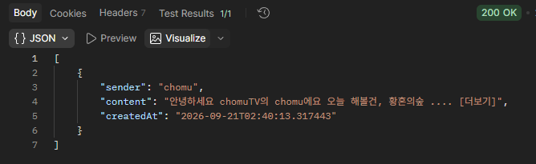

`sender`에는 메시지에 담긴 값이 아니라 핸드셰이크에서 확정된 접속 닉네임이 들어갑니다. `chat_messages` 테이블에서도 같은 행을 확인할 수 있습니다.

```Bash
select id, world_id, sender_nickname, content, created_at from chat_messages order by id desc limit 5;
```

| 컬럼 | 값 |
|---|---|
| `world_id` | 접속한 월드 ID |
| `sender_nickname` | 접속 닉네임 |
| `content` | 게임에서 입력한 내용 |

> 이 단계까지는 보낸 사람과 다른 참여자의 화면에 채팅이 표시되지 않습니다. 같은 월드의 참여자에게 전달하는 것은 Lv14의 `LocalChatSender` 범위입니다.

</details>

### Lv14. 같은 월드의 참여자에게 채팅 전송
- [x] `WorldBroadcaster.broadcast(worldId, message)`로 같은 월드의 세션에 메시지를 전달합니다. 보낸 사람도 수신 대상에 포함합니다.

<details>
<summary><b>[자세히] </b></summary>

1. 전달 대상 선정을 위임
* 어떤 연결이 그 월드에 속하는지는 `WorldSessionRegistry`가 이미 알고 있으므로, 수신자 목록을 따로 관리하지 않고 월드 ID만 넘김

```java
public void send(Long worldId, Object message) {
    broadcaster.broadcast(worldId, message);
}
```

```java
public void broadcast(Long worldId, Object message) {
    registry.entries(worldId).stream()
            .map(WorldSessionRegistry.Entry::session)
            .forEach(session -> sendTo(session, message));
}
```

`registry.entries(worldId)`가 **해당 월드의 연결만** 반환하므로 다른 월드의 세션은 순회 대상에 들어오지 않습니다. 월드 간 격리가 이 지점에서 성립합니다.

---

2. 보낸 사람이 수신 대상에 포함되는 이유
* 보낸 사람의 세션도 같은 월드의 연결 목록에 들어 있으므로 별도 분기 없이 함께 수신 — 오히려 보낸 사람을 빼려면 세션을 비교해 제외하는 코드가 추가로 필요
* 보낸 사람도 서버가 확정한 시각과 저장 결과를 그대로 받게 되어, 자기 화면에만 다른 값이 표시되는 일이 없음

---

3. 한 번 저장하고 여러 명에게 전송
* Lv13의 `saveMessage()`가 한 번 실행되어 응답 객체 하나를 만들고, 그 **같은 객체**를 월드의 모든 세션에 전달
* 수신자가 몇 명이든 DB에 남는 기록은 한 건

 [LocalChatSender.java 바로가기](./src/main/java/com/gameexpert/chat/service/LocalChatSender.java)

</details>

- [x] 테스트 확인: `LocalChatSenderTest.java`의 주석을 해제한 뒤 실행합니다.

<details>
<summary><b>[자세히]</b></summary>

```Bash
.\gradlew test
```

`broadcastsTheProvidedMessageOnceToTheProvidedWorld`가 검증하는 항목입니다.

| 단언 | 확인하는 것 |
|---|---|
| `broadcast(eq(42L), ...)` | 전달받은 월드 ID를 그대로 넘기는지 |
| `broadcast(..., same(message))` | 메시지를 복사하거나 다시 만들지 않고 **같은 인스턴스**로 넘기는지 |
| `verifyNoMoreInteractions(broadcaster)` | 한 번만 전송하는지 |

```Bash
build/reports/tests/test/index.html
```

</details>

- [x] 확인: 같은 월드의 두 참여자가 보낸 사람, 내용과 시각을 포함한 채팅을 받습니다. 다른 월드의 참여자에게는 전달되지 않으며 DB에는 보낸 채팅 한 건만 저장됩니다.

<details>
<summary><b>[자세히]</b></summary>

같은 월드에 `chomu`와 `chomu2`가 접속한 상태에서 `chomu2`가 채팅을 입력했습니다. 각 화면의 네임플레이트는 **상대방**을 가리키므로, 시점의 주인은 네임플레이트에 없는 쪽입니다.

**보낸 쪽 — `chomu2`의 화면**

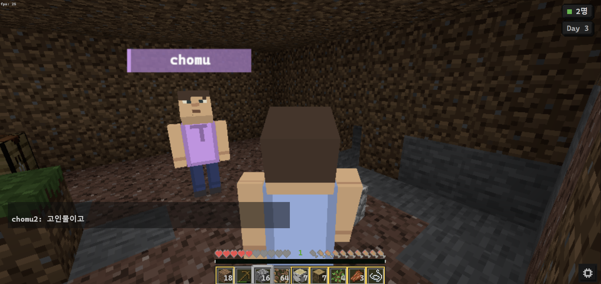

**받은 쪽 — `chomu`의 화면**

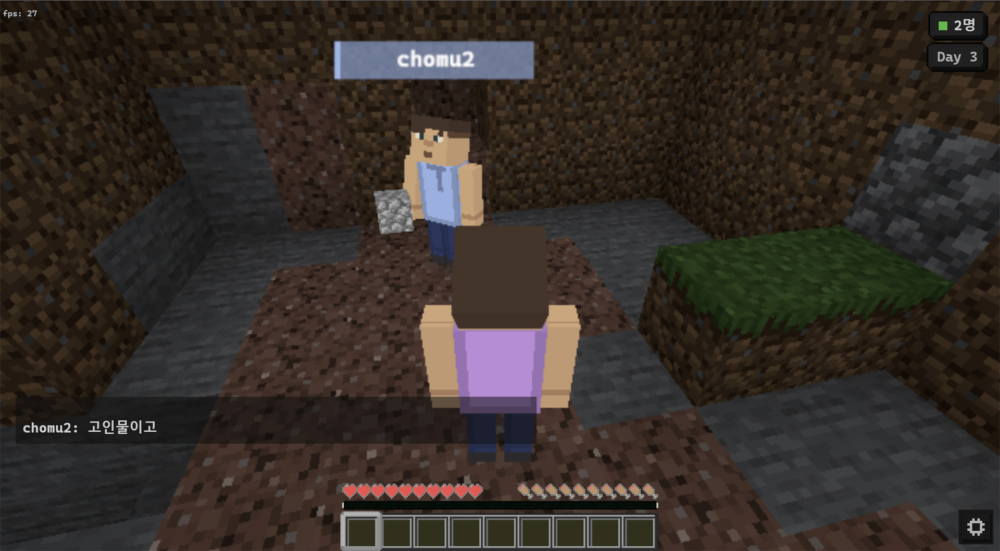

같은 메시지가 두 클라이언트의 채팅창에 `chomu2: 고인물이고` 형태로 함께 표시되고, 우측 상단 접속 인원도 양쪽 모두 `2명`입니다. 보낸 사람 화면에도 표시된 것은 자신의 세션 역시 수신 대상에 포함되기 때문입니다. 응답에 담기는 시각은 Lv13에서 저장 결과의 `createdAt`으로 채워집니다.

전송 이후 `chat_messages`를 조회한 결과입니다.

```Bash
select world_id, sender_nickname, content, created_at from chat_messages order by id desc limit 3;
```

| `world_id` | `sender_nickname` | `content` | `created_at` |
|---|---|---|---|
| 4 | chomu2 | 고인물이고 | 2026-09-21 16:09:00.509909 |
| 4 | chomu | 반갑고 | 2026-09-21 16:06:12.478446 |
| 5 | chomu | 여긴 인사가 없네 | 2026-09-21 16:01:10.976763 |

두 명이 받은 `고인물이고`가 **한 건만** 저장되어 있습니다. 수신자 수와 저장 건수는 무관합니다. 또한 다른 월드(`world_id = 5`)에는 그 월드에서 보낸 메시지만 남아 있으며, 월드 4의 채팅은 월드 5의 참여자에게 전달되지도, 기록되지도 않았습니다.

</details>

### Lv15. 접속자 목록 조회
- [x] `registry.entries(context.worldId())`로 현재 월드의 연결 목록을 조회하고, 각 항목의 `session()` 중 `isOpen()`이 `true`인 세션만 선택합니다.
- [x] 각 세션의 `getAttributes()`에서 `NicknameHandshakeInterceptor.ATTR_NICKNAME`에 저장된 닉네임을 꺼냅니다.
- [x] 닉네임 목록을 명세의 기준대로 정렬해 `users`에, 목록의 크기를 `count`에 담아 `broadcaster.sendTo()`로 요청한 연결에만 응답합니다.

<details>
<summary><b>[자세히] </b></summary>

1. 열린 연결만 추리기

```java
List<String> users = registry.entries(context.worldId()).stream()
        .map(WorldSessionRegistry.Entry::session)
        .filter(WebSocketSession::isOpen)
        .map(session -> (String) session.getAttributes()
                .get(NicknameHandshakeInterceptor.ATTR_NICKNAME))
        .sorted()
        .toList();

broadcaster.sendTo(context.session(), new OnlineUsersResponse(users, users.size()));
```

* 끊어진 연결이 레지스트리에서 즉시 제거된다는 보장이 없으므로 `isOpen()`으로 한 번 더 거름 — 제공 테스트도 닫힌 세션을 목록에 섞어 두고 결과에서 빠지는지 검사
* 닉네임은 Lv7의 핸드셰이크에서 세션 속성에 저장해 둔 값을 사용 — 요청 본문의 값을 신뢰하지 않음

---

2. 정렬 기준과 `count`
* 명세는 "users는 원래 닉네임의 **대소문자를 보존**하고 **Java 문자열 자연 순서**로 정렬한다"고 규정 — `String.compareTo()` 기준이므로 인자 없는 `sorted()`를 사용
* 대소문자를 무시하는 비교자를 쓰면 `Zoe`와 `alice`처럼 대소문자가 섞인 조합에서 순서가 달라짐
* `count`는 "반환한 `users` 배열의 길이"이므로 별도로 세지 않고 `users.size()`를 사용. 명세에 따라 Redis의 인원수와 합산하지 않음

---

3. 요청자에게만 응답
* Lv14의 `broadcast()`는 월드 전체, 이 응답은 `sendTo()`로 **요청한 연결 하나**에만 전달
* 메시지에 `worldId`가 들어 있어도 사용하지 않고 `context.worldId()`를 사용 — Lv12·Lv13과 같은 원칙

 [OnlineUsersWsHandler.java 바로가기](./src/main/java/com/gameexpert/ws/handler/OnlineUsersWsHandler.java) · [OnlineUsersResponse.java 바로가기](./src/main/java/com/gameexpert/ws/dto/OnlineUsersResponse.java)

</details>

- [x] 테스트 확인: `OnlineUsersWsHandlerTest.java`의 주석을 해제한 뒤 실행합니다.

<details>
<summary><b>[자세히]</b></summary>

```Bash
.\gradlew test
```

| 테스트 | 확인하는 것 | 결과 |
|---|---|---|
| `returnsSortedOpenUsersOnlyToRequester` | 닫힌 세션 제외, 자연 순서 정렬, 요청자에게만 응답 | 통과 |
| `returnsZeroForAnEmptyList` | 빈 월드에서 `users: []`, `count: 0` | 통과 |

```Bash
build/reports/tests/test/index.html
```

</details>

- [x] 확인: 게임 창 하나만 남기고, 다른 닉네임으로 Postman에서 같은 월드에 연결해 두 닉네임과 인원수 `2`를 확인합니다. 게임 연결을 종료한 뒤 다시 요청하면 Postman의 닉네임만 남아야 합니다.

<details>
<summary><b>[자세히]</b></summary>

게임 창은 `chomu`로, Postman은 `chomu2`로 같은 월드(`worldId = 4`)에 연결한 뒤 명세의 요청을 보냈습니다.

```
ws://localhost:8080/ws/worlds/4?nickname=chomu2
```

```json
{"type":"onlineUsers"}
```

| 시점 | 접속 상태 | 응답 |
|---|---|---|
| 게임 창 유지 | 게임(`chomu`) + Postman(`chomu2`) | `{"type":"onlineUsers","users":["chomu","chomu2"],"count":2}` |
| 게임 창 종료 후 | Postman(`chomu2`)만 | `{"type":"onlineUsers","users":["chomu2"],"count":1}` |

Postman 연결은 그대로 둔 채 같은 요청을 다시 보냈는데 응답이 달라졌습니다. 목록을 미리 만들어 두고 재사용하는 것이 아니라, 요청 시점의 열린 세션을 그때그때 훑는다는 뜻입니다. 정렬 결과가 `chomu` → `chomu2`인 것도 자연 순서와 일치합니다. 한쪽이 다른 쪽의 접두사이면 짧은 쪽이 앞에 옵니다.

</details>
